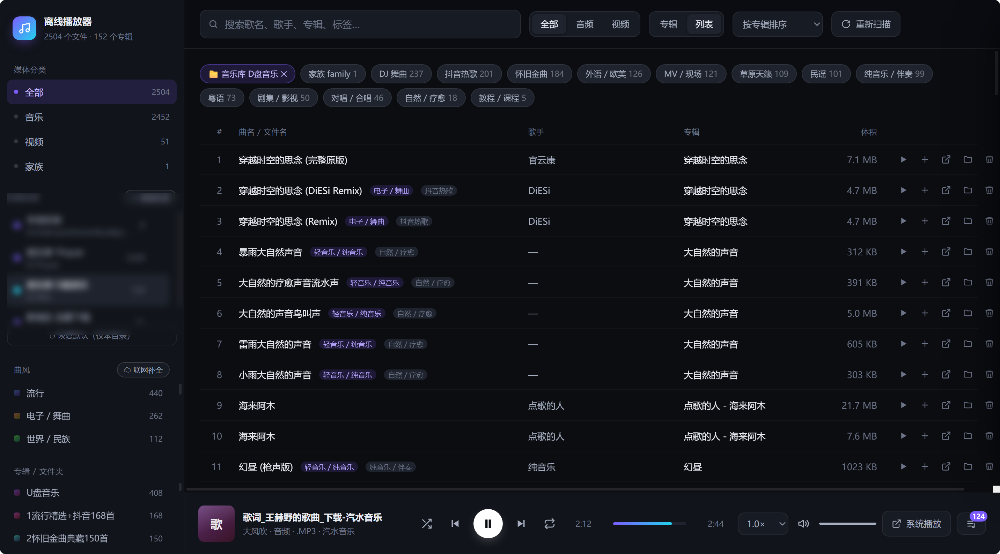

# 离线音乐与视频播放器

一个完全离线的本地媒体库播放器。自动扫描磁盘上的音视频文件，按「音乐 / 视频」归类，音频在网页里直接播放，视频在浏览器**新标签页**打开原生播放器 —— 浏览器解不了的格式（AVI / MKV / RMVB 等）会在本机**自动转成 MP4 后播放**，也能一键交给系统默认播放器（PotPlayer / Windows Media Player 等）。



## 快速开始

双击 **`启动播放器.bat`**，浏览器会自动打开 `http://127.0.0.1:8787`。

关闭那个黑色命令行窗口 = 停止服务。

> 依赖 Node.js（仅用于跑本地服务，不联网、不安装任何第三方包）。

### 可选：让浏览器能播更多格式

浏览器能不能播一个视频，取决于**编码**而不是扩展名。AVI / MKV / RMVB 里的老编码（尤其是 DivX / Xvid 那类 MPEG-4 Part 2）**任何浏览器都解不了**，换容器也没用。

本机装了 **ffmpeg** 的话，播放器会自动接管：点开这类视频时先转成浏览器能播的 MP4 —— 编码本来就兼容的只换容器（秒级、画质零损失），不兼容的才重编码。转一次就存下来，之后点开秒播。

```bash
# 装 ffmpeg（任选其一）
winget install ffmpeg          # Windows
brew install ffmpeg            # macOS
```

没装也完全不影响使用，只是这类视频会继续交给系统播放器。装了但提示「不可用」，就在 `config.json` 的 `ffmpegPath` 里填绝对路径。

## 扫描范围怎么设

**默认**：一个目录都没添加时，只扫描**播放器所在目录**及其子目录 —— 把媒体文件扔进这个文件夹就能直接用。

想加别的位置，点侧栏的 **「＋ 添加目录」**，在目录选择器里逐级点进去（也可以直接粘贴路径，如下例）。
侧栏点某个目录 = 只看它的内容；**「↺ 恢复默认」**一键清空所有扫描目录，回到默认范围。

这些选择会写进 `config.json` 的 `roots`。也可以直接手动编辑该文件，改完在页面上点「重新扫描」，无需重启。

| 配置项 | 作用 |
|---|---|
| `port` | 本地服务端口，默认 `8787` |
| `roots` | 扫描哪些根目录（**留空 = 只扫播放器所在目录**） |
| `excludeDirs` | 扫描时跳过的目录名 |
| `minSizeKB` | 小于该体积的文件视为音效 / 资源，不计入媒体库 |
| `systemPlayer` | 「系统播放」按钮调用的播放器路径，**留空则使用系统文件关联** |
| `tags` | 智能标签的名称与关键词 |
| `transcodeEnabled` | 是否启用「自动转码成浏览器可播格式」 |
| `ffmpegPath` / `ffprobePath` | ffmpeg 路径，**留空则用系统 PATH** |
| `transcodeCacheDir` | 转换产物目录，**留空 = 播放器目录下的 `.transcode-cache`** |
| `transcodeCacheMaxGB` | 转换缓存上限（GB），超出按最久未使用清理 |
| `transcodePreset` / `transcodeCrf` | 转码速度与画质（默认 `veryfast` / `21`） |

> **`config.json` 不入版本库**（其中含本机路径等个人配置）。
> 首次运行若不存在，程序会自动用 `config.example.json` 的默认值，
> 并在你第一次添加扫描目录时生成 `config.json`。想手动改配置就先
> `cp config.example.json config.json`，模板里每个字段都带注释说明。

## 功能

**播放**
- 播放 / 暂停、上一个 / 下一个、随机播放、列表循环 / 单曲循环
- 拖动进度条任意跳转（服务端支持 Range 断点续传，即拖即响）
- 音量、静音、0.5×–2× 变速
- 播放队列：可拖拽排序、单项移除、一键清空
- **视频在新标签页播放**：点视频（或按 ▶）会打开独立的 `/play` 页面，用浏览器原生播放器播 —— 全屏、画中画、系统音量、快捷键都在，不再挤在网页的弹层里
- **解不了的格式自动转换**：AVI / MKV / RMVB 这类点开后会在页面上显示转换进度，转好自动开始播放；已转过的直接秒开（需要本机有 ffmpeg，见上文）

**组织**
- 三级归类：大类（音乐 / 视频）→ 专辑 / 文件夹 → 单曲
- 智能标签自动打标：抖音热歌、DJ 舞曲、怀旧金曲、粤语、草原天籁、民谣、纯音乐/伴奏、对唱/合唱、外语欧美、自然疗愈、MV/现场、剧集影视、教程课程
- 搜索（歌名 / 歌手 / 专辑 / 标签 / 路径，空格分隔多关键词）、按标签筛选
- 排序：专辑 / 曲名 / 歌手 / 体积 / 修改时间
- 专辑视图（封面墙，双击直接播放整张）与列表视图切换

**系统集成**
- **视频 → 浏览器新标签页**：点视频（或按 ▶）就开新标签页，用浏览器原生播放器播；容器解不了的会**先自动转成 MP4 再播**（需 ffmpeg）
- **自动转码缓存**：转换产物存在 `.transcode-cache/`，超过上限按最久未使用自动清理；`POST /api/cache {"action":"clear"}` 可一键清空
- **系统播放**：调用本机默认程序打开文件 —— 字幕、多音轨、无损音轨都交给它处理最省心
- **在资源管理器中定位**：直接跳到文件所在文件夹
- **导出 M3U8**：把当前队列导出成 `播放列表导出/*.m3u8`，可在 PotPlayer 等播放器里直接打开

**快捷键**

| 键 | 作用 |
|---|---|
| `空格` | 播放 / 暂停 |
| `← →` | 快退 / 快进 5 秒 |
| `↑ ↓` | 音量 |
| `N` / `P` | 下一个 / 上一个 |
| `S` / `R` / `M` | 随机 / 循环 / 静音 |
| `Q` | 播放队列 |
| `/` | 聚焦搜索框 |
| `Esc` | 关闭弹窗 |

## 文件说明

```
离线网页播放器/
├── 启动播放器.bat        一键启动（双击这个）
├── server.js             本地服务：扫描索引 + 媒体流 + 系统集成
├── index.html            播放器界面（单文件，含全部样式与脚本）
├── config.example.json   配置模板（字段带注释，含默认分类规则）
├── config.json           你的实际配置（不入库，首次保存时自动生成）
├── install-node.bat      一键安装 Node.js（可选，仅缺 Node 时用）
└── 播放列表导出/          导出的 m3u8 落在这里
```

## 自定义分类

`config.json` 里两处可调：

- `roots` —— 扫描哪些根目录（一般不用手改，页面上「＋ 添加目录」更直观）
- `tags` —— 智能标签的名称与关键词

改完保存，页面上点「重新扫描」即可，不用重启。

## 更新记录 · 2026-10-06 晚

### 1. 「在资源管理器中定位」修好了
之前窗口其实打开了，但会默默开在浏览器**后面**，看起来像没反应。
现在打开后会自动把资源管理器窗口**提到前台并选中该文件**。

### 2. 删除功能（移入系统回收站）
列表行末新增 🗑 按钮 → 弹确认框 → 文件进入**系统回收站**（可随时还原，不是永久抹除）。
- 服务端只允许删除媒体库目录内的文件；播放器自身的核心文件（server.js / index.html / config.json 等）受保护不可删
- 删除成功后媒体库自动重扫，正在播放的文件被删时会停止播放
- 正被 PotPlayer 占用的文件可能删除失败，会如实提示

### 3. 视频点击播放 = 交给本地播放器
点击任何视频（或按 ▶）直接用 PotPlayer 打开。
> 此行为已在 [2026-10-07 更新](#更新记录--2026-10-07) 中改为**浏览器新标签页播放**。

### 4. 曲风三层分类 + 联网补全
侧栏新增「曲风」区：**音乐 → 曲风 → 专辑** 三层导航。
- 离线阶段按 17 类规则（流行 / 摇滚 / 嘻哈 / 电子 / 爵士 / 古典 / 民谣 / 乡村 / R&B / 金属 / 雷鬼 / 拉丁 / 世界民族 / 原声 / 轻音乐 / 儿歌 / 中国风戏曲）从目录名与文件名判定
- 判定不出的归入「未识别」；点曲风区的 **☁ 联网补全**，检测到网络时逐批向 iTunes 资料库查询，结果缓存在 `genre-cache.json`（已查过的不会重复请求）

## 更新记录 · 2026-10-06 深夜：扫描范围完全可控

### 核心变化：不再「扫什么」由配置文件说了算，而是由你在页面上决定

- **侧栏新增「扫描目录」区**：列出当前所有扫描目录、各自的文件数与体积，鼠标悬停可 ✕ 移除
- **「＋ 添加目录」打开目录选择器**：从磁盘列表逐级点进去，或直接粘贴路径（支持 `D:/Music`、`E:/音乐` 两种斜杠写法）；可设显示名称与所属分类（音乐 / 视频 / 本地）
- **默认范围**：一个目录都没添加时，只扫描**播放器所在文件夹**及其子目录（侧栏会显示「当前为默认范围」）
- **「↺ 恢复默认」**：一键清空全部扫描目录，回到默认范围

### 安全与体验护栏

- 直接添加整个磁盘（如 `E:/`）会被拦下并要求二次确认 —— 防止误做全盘扫描
- 系统目录（Windows、Program Files 等）在选择器里标黄提醒
- 已在扫描范围的目录在选择器里标「已在扫描范围」，不会重复添加
- 播放器所在目录在你添加第一个目录时会被自动保留，本地文件不会突然消失

### 扫描引擎重写（异步 + 进度可见）

- 扫描改为后台异步执行：添加超大目录时页面不再卡死白屏，启动遮罩/「重新扫描」按钮上实时显示「已访问多少文件夹 · 发现多少媒体文件」
- 扫描途中增删目录也能正确收敛（补扫机制），不会残留已移除的目录
- 服务新增接口：`/api/roots`（清单）、`/api/browse`（服务端目录浏览）、`/api/roots/add|remove|reset`、`/api/scan-status`
- 侧栏点某个扫描目录 = 只看该目录的文件（列表顶部会出现可点掉的 📁 筛选条）
- 页面可用 `#add-dir` 直达「添加扫描目录」

## 更新记录 · 2026-10-07

### 浏览器不再挑格式：AVI / MKV 自动转码后播放

以前点开 AVI / MKV 只能交给外部播放器。现在只要本机有 ffmpeg，播放器会自己把容器
转成浏览器能播的 MP4 —— 编码本来就兼容的（H.264 + AAC）**只换容器，秒级、画质零损失**；
老编码（DivX / Xvid 那类 MPEG-4 Part 2）才重编码。

- `/play` 页显示转换进度，转好自动开始播放，不用手动刷新
- 产物缓存在 `.transcode-cache/`，再点秒开；超出上限按最久未使用自动清理
- 没有 ffmpeg 时这项自动关闭，行为退回「交给系统播放器」，其它功能不受影响
- 列表里这类文件标为「转换后可播」（无 ffmpeg 时仍显示「需系统播放器」）
- 实测速度：40MB 的 AVI 换容器 0.6 秒；4 分钟 720×480 的 AVI 重编码 5.6 秒；1080p 的 TS 换容器 0.5 秒

### 视频改为在浏览器新标签页播放

点视频（或播放列表里的 ▶）不再交给外部播放器、也不再弹页内浮层，而是新开一个标签页，
用浏览器原生播放器播 —— 全屏、画中画、系统音量、媒体键都能用。

- 新页面为服务端渲染的 `/play?id=<曲目 id>`，与主页同源，标题、格式、专辑、体积都带过去
- 页内提供「用系统播放器打开」「在资源管理器中定位」「关闭标签页」，`Esc` 直接关标签页
- **浏览器解不了的格式也照样开页**：MKV / AVI / WMV / RMVB 等会先在页面上转码成 MP4 再自动播放（需 ffmpeg）；没有 ffmpeg 时才退回「用系统播放器打开」按钮
- 曲名本身是真实的 `<a target="_blank">` 链接 —— 原生链接点击不会被浏览器的「弹出窗口拦截」挡下
- 播放页用固定的窗口名，连着点几个视频只复用同一个标签页，不会越点越多
- 相应地移除了页内的视频浮层与 `<video>` 元素，主页面收敛为纯音频播放器，播放/进度/音量只作用于音频

### 界面（同批）

- 侧栏宽度可拖拽（200–560px，双击复位）；侧栏内「扫描目录 / 曲风」分区高度也可拖拽，专辑区自适应
- 列表顶部的智能标签栏与字段表头滚动时固定，两层之间无缝隙
- 侧栏「媒体分类」换成「关于」卡片（作者 / 版本 / GitHub 仓库）
- 移除了「家族 family」分类
